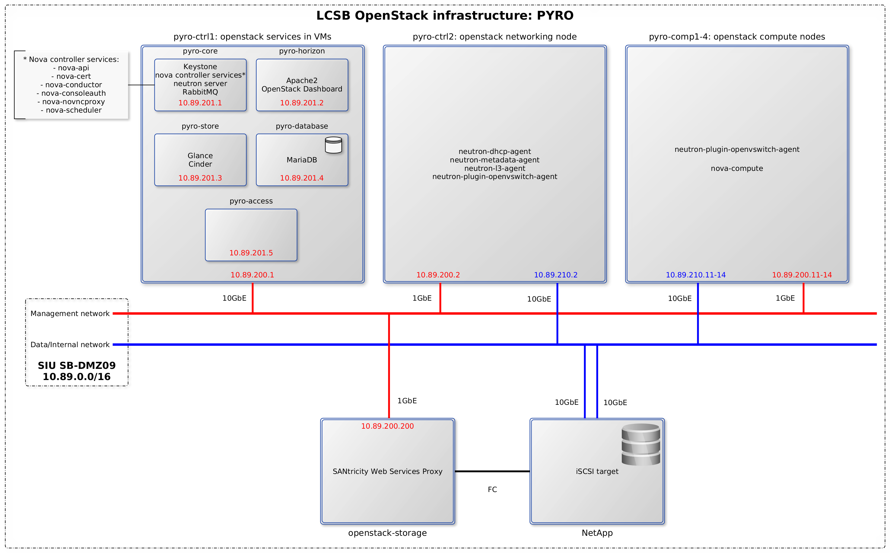

# Overview of the OpenStack architecture

## Overview

This document purpose is to provide information on the OpenStack architecture in an efficient way so that it isn't necessary to read all the documentation to start working on this installation.

The first point of this overview is to provide information on the network architecture of the installation.  
The second point describes what are the services provided and their repartition among the various servers.  
The third point gives a few guidelines to extends the current architecture through the addition of new components.

Go to:
- [Network architecture](#network-architecture)
- [Service map](#service-map)
- [Extension guidelines](#extension-guidelines)

## Network architecture

The OpenStack installation is done in the 10.89.0.0/16 subnet where the address repartition is as follow:

10.89.200.[0-254] : Physical servers
10.89.201.[0-254] : OpenStack services Virtual Machines
10.89.210.[0-254] : Data network

10.89.[1-199].[0-254] : Floating IPs network
192.168.1.0/24 : etriks tenant subnet (Private IPs)

## Service map

## Extension guidelines

### Adding a new service

A new service can either be a new OpenStack component or an external service such as a monitoring service or a database. These services are meant to run on Virtual Machines on one of the controller nodes.

Their IP address is then to be chosen in the 10.89.201.[0-254] range.

### Adding a compute node

Adding a compute node is straightforward: follow the instructions in this documentation for the installation of a [compute node](Compute.md) using the next IP address available after the last compute node. (e.g: currently the last compute node's IP addresses are 10.89.200.14 and 10.89.210.14, so a new compute node's IP addresses would be 10.89.200.15 and 10.89.210.15).
