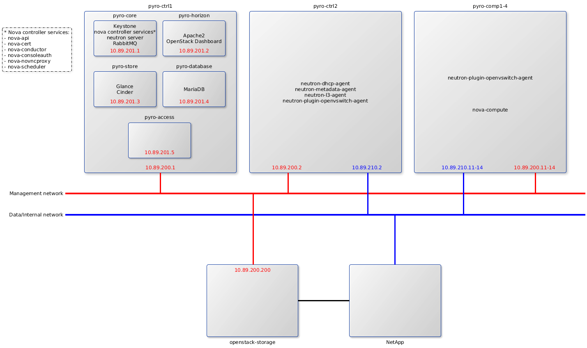

# Overview of the OpenStack architecture

## Overview

This document purpose is to provide information on the OpenStack architecture in an efficient way so that it isn't necessary to read all the documentation to start working on this installation.

The first point of this overview is to provide information on the network architecture of the installation.  
The second point describes what are the services provided and their repartition among the various servers.

Go to:
- [Network architecture](#network-architecture)
- [Service map](#service-map)

## Network architecture

The OpenStack installation is done in the 10.89.0.0/16 subnet where the address repartition is as follow:

10.89.200.0/24 : Physical servers
10.89.201.0/24 : OpenStack services Virtual Machines
10.89.210.0/24 : Data network

10.89.[1-199].[0-254] : Floating IPs network
192.168.1.0/24 : etriks tenant subnet (Private IPs)

## Service map

